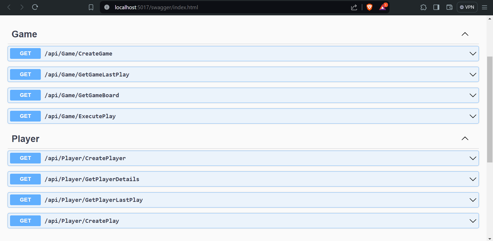

# Connect 4 Web API Solution

Welcome to the Connect 4 Web API Solution, developed in C# using the ASP.NET framework.

## Installation

To get started, follow these instructions:

1. Clone the repository to your local machine:

```bash
git clone https://github.com/Chino96/Connect-4-Dotnet.git
```

2. Navigate to the project directory:

```bash
cd Connect-4-Dotnet
```

## Running Unit Tests

Unit tests ensure the reliability and correctness of the solution. You can run the tests in Visual Studio Code with the help of the [C# Dev Kit extension](https://marketplace.visualstudio.com/items?itemName=ms-dotnettools.csdevkit). If you prefer to run tests without extensions, execute the following commands in the terminal:

```bash
cd ./API.Tests
dotnet test
```

## Running the API

To run the API, follow these steps:

1. Navigate to the API directory:

```bash
cd ./API
```

2. Execute the following command to start the API:

```bash
dotnet run
```

3. Once the API is running, a browser window will open, displaying the available endpoints.

## Endpoints

The API provides the following endpoints:


Feel free to explore these endpoints to interact with the Connect 4 Web API Solution.

---
Chinonyerem Ugwumadu Advanced Software Engineering 2024
Dr. Ryan Florin
