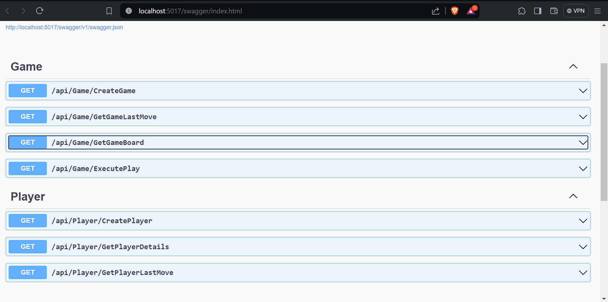

# This is a Connect 4 Web API Solution built in C# using the ASP.NET framework
## The solution includes a Unit Testing project that can be run in VS Code using the following extensions:
- ### [C# Dev Kit](https://marketplace.visualstudio.com/items?itemName=ms-dotnettools.csdevkit)
## Tests can also be run without extensions by executing the following commands:
- ### `cd ./Connect-4-Dotnet/Api.Tests`
- ### `dotnet test`
## To run the API code follow the instructions below.
- ### Run the following commands from the project home directory 
    - #### `cd ./Connect-4-Dotnet/API`
    - #### `dotnet run`
- ### A browser window will open with the following endpoints to display.
### 